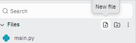
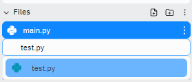
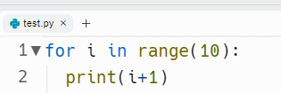

# Multiple Files

By now, you have written some pretty big programs with lots of lines of code.

This can get pretty cumbersome to deal with. Lots of scrolling to find the right bit...

One of the ways to overcome this is to split the code into multiple files.

That's right. Your programs can consist of more than one python file.  The **main** file will always run first, but you can put parts of your code into other files and bring them in to **main.py** by **importing**.  

In fact, you've already done this whenever you've used `import random`, `import time`, `import os` and so on.  It's just that on those occasions, you were importing code written by someone else.  

Today, you'll create your own code file and import it into your main program.

👉 Let's start with a basic 'count to 10' program in the `main.py` file.

```python
for i in range(10):
  print(i+1)
```

👉 Now let's move it to a new file.  

In the **files** menu in your left hand toolbar, find the 'New file' icon and select it.



Name the file **test.py** - you **MUST** include the *.py* to specify that it's a python file.




Cut and paste the code from **main.py** to **test.py**.



By now, your **main.py** file should have nothing in it.

👉 Now click 'run'.  Watch in amazement *as nothing happens*!

Remember, Python runs the code in the **main.py** file, which at the moment is empty.  So we need to import the code.

👉 Go to your **main.py** file and add this code.


```python
import test # No need for the .py
```
👉 Now run the code and watch the 'count to 10' program execute.

## It Can't Be That Easy? Can It?

Well....... no. Because we can't control **when** the 'count to 10' program runs. It just runs on import.  In this example, it would run *before* the `print("Countdown")` code. Not ideal.

```python
import test

print("Countdown")
```
To solve this, we need to think more like libraries. They consist of a bunch of subroutines that we can import and then **call only when we need them**.

👉 Back in your **test.py** file, you need to make the countdown program a subroutine.

```python

def countdown():
  for i in range(10):
    print(i+1)
```

👉 Finally, let's call it in our **main.py** file.

```python
import test

print("Countdown")
test.countdown() # Test refers to the file, countdown to the subroutine in that file.
```

### Try it out!